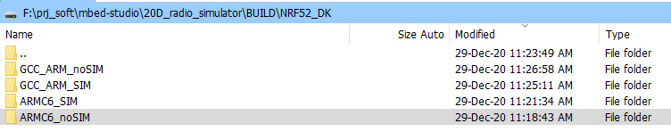

# 20D_radio_simulator

Testing for Node simulatedRadio.  
The serial output for both Designs, with and without SimulatedRadio has to be the same

----

## nBlocksStudio Schematic Design with simulatedRadio

<!-- pagebreak -->

## nBlocksStudio Schematic Design without simulatedRadio

<!-- pagebreak -->

## nBlocksStudio Translation with simulatedRadio
 *  Translation with `assist` Pass :heavy_check_mark:
 *  Compilation with `assist` GCC_ARM Pass :heavy_check_mark:
 *  Compilation with `assist` ARMC6 Pass :heavy_check_mark:
 *  Compilation with `mbed-studio` GCC_ARM Pass :heavy_check_mark:

<!-- pagebreak -->

## nBlocksStudio Translation without simulatedRadio
 *  Translation with `assist` Pass :heavy_check_mark:
 *  Compilation with `assist` GCC_ARM Pass :heavy_check_mark:
 *  Compilation with `assist` ARMC6 Pass :heavy_check_mark:
 *  Compilation with `mbed-studio` GCC_ARM Pass :heavy_check_mark:

<!-- pagebreak -->

## Compilation with 2 different compilers using nBlocksStudio `assist`

----