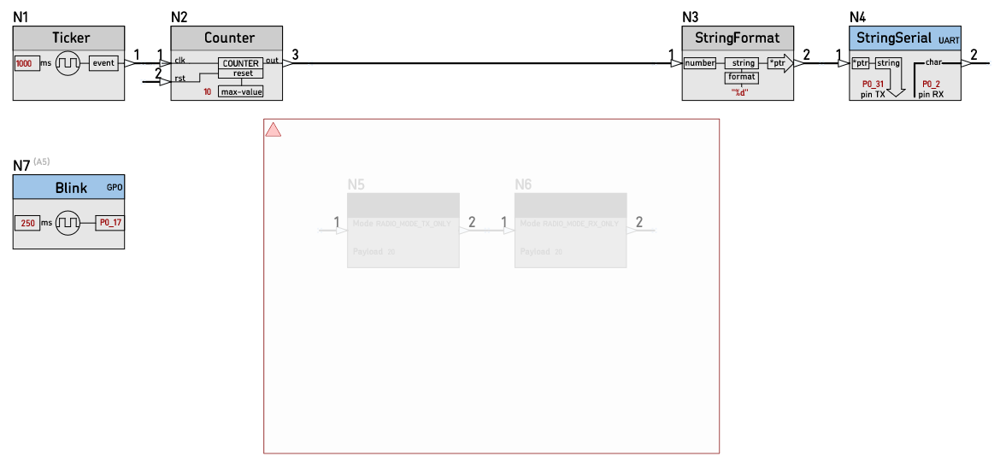
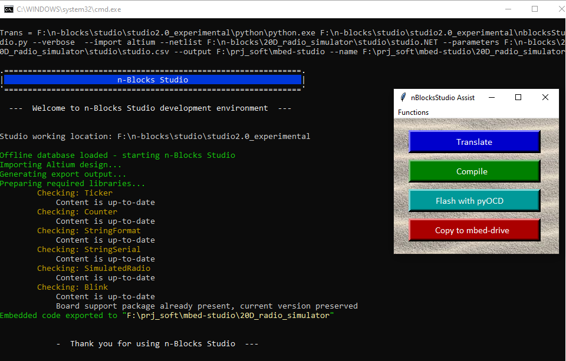
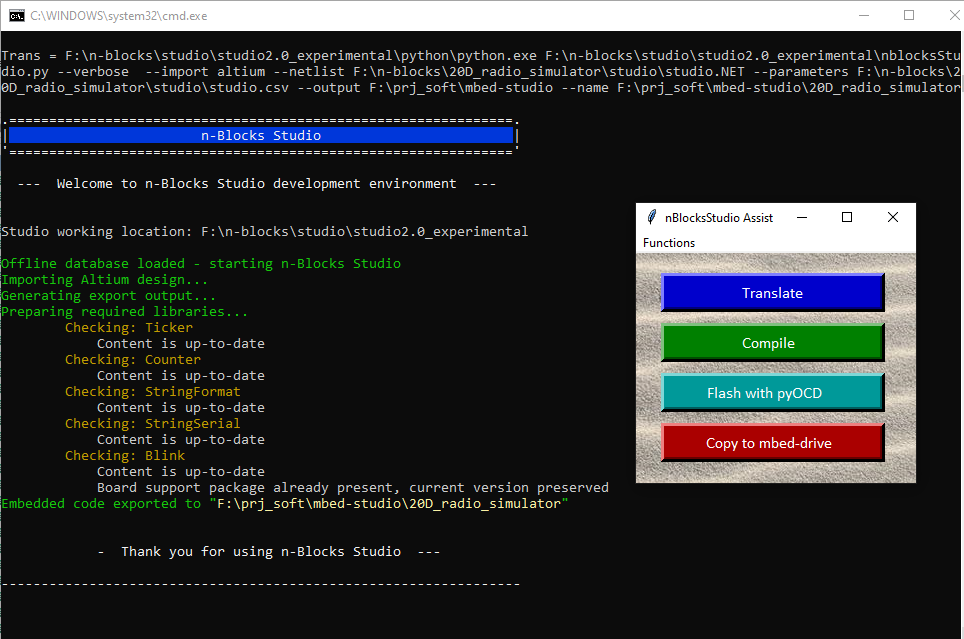

# 20D_radio_simulator

Testing for Node simulatedRadio.  
The serial output for both Designs, with and without SimulatedRadio has to be the same. The firmware repo is [here](https://github.com/nBlocksStudioApps/20D_radio_simulator_firmware)

----

## nBlocksStudio Schematic Design with simulatedRadio

<!-- pagebreak -->

## nBlocksStudio Schematic Design without simulatedRadio

<!-- pagebreak -->

## nBlocksStudio Translation with simulatedRadio
 *  Translation with `assist` Pass :heavy_check_mark:

<!-- pagebreak -->

## nBlocksStudio Translation without simulatedRadio
 *  Translation with `assist` Pass :heavy_check_mark:

